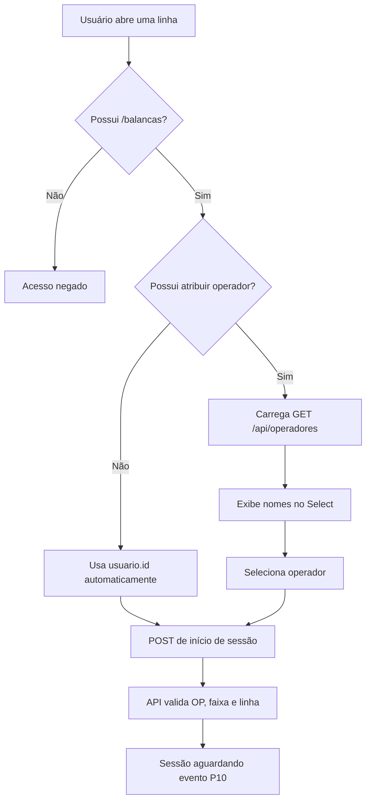

# Controle de acessos — Balanças TI400

Este documento descreve o fluxo de autorização do módulo Balanças do ExattoAPP, desde o cadastro legado no banco de dados até o comportamento da tela e da API.

## Visão geral

```text
Chart_Menus_Avatim
        |
        | LoginApp + ObterUrlsExattoApp
        v
Banco Avatim
  TB_ACESSO_WEB
  TB_USUARIOACESSO_WEB
  VW_USUARIOACESSOWEB
        |
        | lista de DS_URL
        v
ExattoAPP
  UserContext
  temAcesso(path)
  menus, abas e botões
        |
        v
ExattoTI400API
  sessões, operadores, pesagens,
  impressão, relatórios e configurações
```

O padrão legado representa os acessos como paths armazenados em `DS_URL`. Um path pode representar uma rota navegável ou uma permissão de ação interna.

## Origem: Chart_Menus_Avatim

Projeto:

```text
C:\Users\Avatimn-TI\source\repos\tiavatim\Chart_Menus_Avatim
```

Arquivos principais:

- `ExattoWEB/Controllers/ContaController.cs`
- `ExattoWEB/Controllers/AcessoController.cs`
- `AcessoBancoDeDados/UsuarioDAO.cs`
- `AcessoBancoDeDados/AcessoDados/AcessoDAO.cs`
- `AcessoBancoDeDados/AcessoDados/MenuDAO.cs`

### Login

O APP chama:

```text
POST Conta/LoginApp
```

O `ContaController` valida:

1. `idAplicacao`;
2. `apiKey`;
3. usuário e senha em `vw_acessoschart`;
4. dados básicos do usuário.

No APP, o `idAplicacao` é `5` e a API Key é adicionada pelo interceptor de [apiService.ts](../src/services/apiService.ts).

### Consulta dos acessos

Depois do login, o APP chama:

```text
POST Acesso/ObterUrlsExattoApp
```

O método consulta a view `VW_USUARIOACESSOWEB` usando:

```sql
DS_ACESSO LIKE 'ExattoApp%'
AND ID_USUARIO = @idUsuario
```

O retorno principal é uma lista de `DS_URL`.

Exemplo:

```json
[
  "/separacaocomum",
  "/busca",
  "/balancas"
]
```

O endpoint individual também existe:

```text
POST Acesso/UsuarioTemAcessoExattoApp
```

Ele verifica se um usuário possui uma URL específica.

## Estrutura do banco

### `TB_ACESSO_WEB`

Catálogo das funcionalidades e permissões.

Campos utilizados:

| Campo | Finalidade |
|---|---|
| `ID_ACESSO` | Identificador do acesso |
| `DS_ACESSO` | Nome descritivo |
| `DS_URL` | Path da rota ou permissão |
| `TP_ATIVO` | Ativo/inativo |
| `TP_INTERNO` | Indicador de acesso interno |

### `TB_USUARIOACESSO_WEB`

Vincula o acesso ao usuário e à filial.

| Campo | Finalidade |
|---|---|
| `ID_USUARIO` | Usuário que recebe o acesso |
| `ID_ACESSO` | Acesso concedido |
| `ID_FILIAL` | Filial do vínculo; para este fluxo usamos `1` |

### `VW_USUARIOACESSOWEB`

É a view consumida pelo Chart Menus e pelo APP. Combina:

```text
TB_ACESSO_WEB
TB_USUARIOACESSO_WEB
TB_FILIAL
TB_USUARIO
TB_PESSOA
```

### `VW_WEB_USUARIOS_ACESSOMENU`

É usada pelo menu web tradicional. Acrescenta a hierarquia de:

```text
TB_MENU_PRINCIPALCHART
```

O APP não depende dessa hierarquia; ele trabalha diretamente com os paths.

## Funcionamento no APP

Arquivos principais:

- [src/components/inputLogin.tsx](../src/components/inputLogin.tsx)
- [src/contexts/UserContext.tsx](../src/contexts/UserContext.tsx)
- [app/_layout.tsx](../app/_layout.tsx)
- [app/home.tsx](../app/home.tsx)
- [src/services/loginServices.ts](../src/services/loginServices.ts)

Após o login, o APP salva em `AsyncStorage` a chave `@user`, contendo os dados do usuário, `loginTimestamp` e `rotasPermitidas`.

O `UserContext` expõe:

```ts
temAcesso(path: string): boolean
```

Exemplo:

```ts
const podeAtribuir = temAcesso('/balancas/sessao/atribuir-operador');
```

O login local expira no início de um novo dia.

## Módulo Balanças

A tela principal é:

```text
app/balancas.tsx
```

As subtelas são estados internos do módulo, não rotas independentes:

```text
hub
acabamento
relatorios
rastreabilidade
faixas
configuracoes
```

Por isso existe um acesso de entrada:

```text
/balancas
```

E paths adicionais para ações internas.

## Acessos criados

### Navegação e operação

```text
/balancas
/balancas/sessao/iniciar-propria
/balancas/sessao/atribuir-operador
/balancas/sessao/cancelar
/balancas/sessao/retry
/balancas/faixas
/balancas/quantidade-caixa
/balancas/reimpressao
/balancas/relatorios
/balancas/rastreabilidade
```

### Configurações exclusivas do TI

```text
/balancas/configuracoes/linhas
/balancas/configuracoes/impressoras
/balancas/configuracoes/gerais
/balancas/configuracoes/sincronizacao
/balancas/configuracoes/impressao
```

Relatórios e exportação XML usam o mesmo acesso:

```text
/balancas/relatorios
```

## Perfis

O banco legado não possui, para este módulo, um campo formal de perfil TI/Supervisor/Operador. O perfil é representado pelo conjunto de acessos concedidos ao usuário.

### Operador

Pode:

- abrir Balanças;
- iniciar sessão usando o próprio usuário logado;
- consultar sessões e pesagens;
- acessar rastreabilidade;
- cadastrar/editar faixa de peso;
- informar quantidade por caixa;
- reimprimir etiquetas;
- gerar relatórios e exportar XML.

Não pode:

- atribuir outro operador;
- alterar linhas;
- alterar impressoras;
- alterar configurações gerais;
- sincronizar manualmente;
- alterar o modo de impressão.

A tela mostra o nome do usuário em campo desabilitado:

```text
Operador responsável
[ Maria Oliveira                    ]  bloqueado
```

O ID usado na sessão é o `usuario.id`.

### Supervisor

Possui os acessos do operador e também pode:

- atribuir outro operador por um seletor de nomes;
- cancelar sessões;
- retomar sessões em erro.

O APP mostra nomes, não IDs:

```text
Operador responsável
[ João da Silva                 v ]
```

O ID fica somente no valor interno do item selecionado.

### TI

Possui todos os acessos de operador e supervisor, além de:

- cadastrar, editar e desativar linhas;
- cadastrar, editar e desativar impressoras;
- alterar configurações gerais;
- executar sincronização manual;
- alterar modo de impressão;
- atuar em diagnóstico e suporte.

## Fluxo de início de sessão



Para operador comum:

```json
{
  "lote": 12345,
  "idColaborador": 123
}
```

O `123` deve corresponder ao usuário logado. Na evolução do contrato da API, o ID poderá ser resolvido exclusivamente no servidor.

Para supervisor/TI:

```json
{
  "lote": 12345,
  "idColaborador": 456
}
```

A API deve registrar futuramente, de forma separada:

```text
usuário que iniciou a sessão
operador atribuído à produção
```

## API de operadores

Endpoint implementado:

```text
GET /api/operadores
```

Arquivos:

- [OperadoresController.cs](../../ExattoTI400API/Controllers/OperadoresController.cs)
- [OperadorItem.cs](../../ExattoTI400API/Models/OperadorItem.cs)
- [ICacheRepository.cs](../../ExattoTI400API/Repositories/ICacheRepository.cs)
- [SqlCacheRepository.cs](../../ExattoTI400API/Repositories/SqlCacheRepository.cs)

Fonte:

```text
TI400DB.dbo.TB_TI400_OPERADOR
```

Retorno:

```json
[
  {
    "id": 456,
    "nome": "João da Silva"
  }
]
```

O APP exibe apenas `nome`; o `id` é usado internamente ao enviar a sessão.

Os operadores precisam estar sincronizados no cache local. Se a lista vier vazia, execute o `pull` de sincronização.

## Script SQL

Arquivo:

[ACESSOS_EXATTOAPP_BALANCAS.sql](../../ExattoTI400API/Database/ACESSOS_EXATTOAPP_BALANCAS.sql)

O script possui blocos independentes:

1. Criar/ativar o catálogo de acessos.
2. Conceder acessos a operadores.
3. Conceder acessos a supervisores.
4. Conceder todos os acessos ao TI.

### Bloco 1

Executar uma vez. Cria os registros em `TB_ACESSO_WEB` sem duplicar acessos existentes.

### Bloco de operadores

Preencher somente os IDs:

```sql
INSERT INTO @Usuarios (ID_USUARIO) VALUES
(123),
(456);
```

Concede acesso ao módulo, operação própria, faixas, quantidade de caixa, reimpressão, relatórios e rastreabilidade.

### Bloco de supervisores

Concede os acessos de operador, mais atribuição de operador, cancelamento e retry.

### Bloco de TI

Concede todos os acessos cujo path começa com:

```text
/balancas
```

Assim, novos acessos do módulo também podem ser concedidos ao TI ao executar novamente o bloco.

### Observação sobre `GO`

`GO` não é um comando SQL do servidor; é um separador do SSMS/sqlcmd. Se o cliente utilizado não reconhecer `GO`, execute cada bloco separadamente ou remova os separadores e use nomes de variáveis diferentes por bloco.

## Estado da implementação

Já implementado:

- carregamento de operadores pela API;
- seletor visual de nomes para supervisor/TI;
- campo do usuário logado desabilitado para operador comum;
- helper `temAcesso(path)`;
- resolução do operador logado no APP;
- script de criação e concessão por perfil.

Próximas proteções recomendadas na API:

- validar no servidor a permissão `/balancas/sessao/atribuir-operador`;
- rejeitar `idColaborador` diferente do usuário logado quando o chamador não possuir essa permissão;
- registrar usuário executor e operador atribuído;
- validar permissões específicas nos endpoints de configuração, relatório, reimpressão e sincronização.
